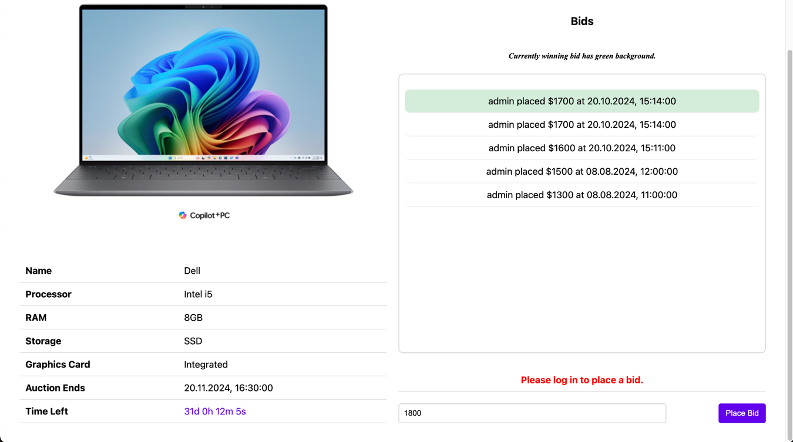
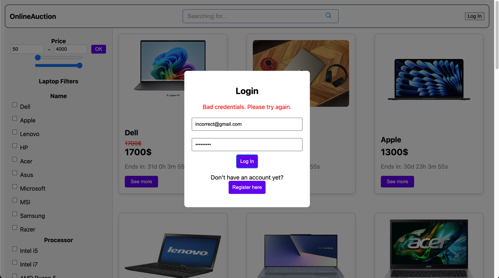

# Testing

## Test Plan

### Test case 1

Description: A user can view the list of auctioned products without having to log in

Preconditions: The user is not logged in

| Step    | Action                               | Expected results                        |
| -------- |--------------------------------------|-----------------------------------------|
| 1  | Open the website                     | The list of auctioned products is shown |

### Test case 2

Description: A user can view the details of an auctioned product without having to log in, such as 
- the name of the product
- the price
- who placed bids
- when the auction ends

Preconditions: The user is not logged in

| Step    | Action                                            | Expected results                        |
| -------- |---------------------------------------------------|-----------------------------------------|
| 1  | Open the website                                  | The list of auctioned products is shown |
| 2  | Click on a "See more" button of a desired product | The details of the product are shown    |

### Test case 3

Description: The user can search the list of auctioned products on a name

Preconditions: The user is not logged in

| Step    | Action                                          | Expected results                         |
| -------- |-------------------------------------------------|------------------------------------------|
| 1  | Open the website                                | The list of auctioned products is shown  |
| 2  | Click on a search bar in the header of the page | The cursor is placed in the search bar   |
| 3  | Type a name of a product                        | The typed name appears in the search bar |
| 4  | Click on the search button                      | The list of auctioned products is shown  |

### Test case 4

Description: Bids cannot be removed or modified once they are made

Preconditions: The user is logged in (see [test case 5](#test-case-5) for the login test)

| Step | Action                                                                            | Expected results                         |
|------|-----------------------------------------------------------------------------------|------------------------------------------|
| 1    | Open a website                                                                    | The list of auctioned products is shown  |
| 2    | Log in as a non admin user                                                        | The user is logged in, the list of products is shown again  |
| 3    | Click on a "See more" button of a desired product                                 | The details of the product are shown   |
| 4    | Place a bid on the product (see [test case 6](#test-case-6) for the bidding test) | The bid is placed |
| 5    | Try to remove the bid (there is no functionality for removing bids provided)      | The bid cannot be removed  |

### Test case 5

Description: A user can log in

Preconditions: The user is not logged in

| Step    | Action                                                                                                                                                                                                    | Expected results                                          |
| -------- |-----------------------------------------------------------------------------------------------------------------------------------------------------------------------------------------------------------|-----------------------------------------------------------|
| 1  | Open a website                                                                                                                                                                                            | The list of auctioned products is shown                   |
| 2  | Click on a "Log in" button in the header of the website                                                                                                                                                   | The Log In modal is shown                                 |
| 3  | Fill in the according credentials to log in as a non-admin user: **email**: _user@gmail.com_  **password**: _password_  OR **email**: _admin@gmail.com_  **password**: _password_ to log in as admin user | The credentials appear in the input fields |
| 4  | Click on the "Log In" button below the input fields or press "Enter" on the keyboard                                                                                                                      | The user is logged in, the list of products is shown again |

### Test case 6

Description: A user can place a bid

Preconditions: The user is logged in (see [test case 5](#test-case-5) for the login test)

| Step    | Action                                                                                                   | Expected results                                           |
| -------- |----------------------------------------------------------------------------------------------------------|------------------------------------------------------------|
| 1  | Open a website                                                                                           | The list of auctioned products is shown                    |
| 2  | Log in as a non admin user                                                                               | The user is logged in, the list of products is shown again |
| 3  | Choose a product to bid on and click "See more" button                                                   | The details of the product are shown                       |
| 4  | Click on the input field below the bid section.                                                          | The cursor will appear in the input field                  |
| 5  | Type the amount of the bid, the amount should be bigger than the current price or the current latest bid | The typed amount appears in the input field                |
| 6  | Click on the "Place bid" button                                                                         | The bid is placed, the list of bids is updated             |

### Test case 7

Description: A user cannot place a bid if they are not logged in

Preconditions: The user is not logged in

| Step | Action                                                                                                   | Expected results                                  |
|------|----------------------------------------------------------------------------------------------------------|---------------------------------------------------|
| 1    | Open a website                                                                                           | The list of auctioned products is shown           |
| 2    | Choose a product to bid on and click "See more" button                                                   | The details of the product are shown              |
| 3    | Click on the input field below the bid section.                                                          | The cursor will appear in the input field         |
| 4    | Type the amount of the bid, the amount should be bigger than the current price or the current latest bid | The typed amount appears in the input field       |
| 5    | Click on the "Place bid" button                                                                         | The bid is not placed, the error message is shown |

### Test case 8

Description: A user cannot place a bid if the amount is incorrect

Preconditions: The user is logged in (see [test case 5](#test-case-5) for the login test)

| Step    | Action                                                                                                     | Expected results                                           |
| -------- |------------------------------------------------------------------------------------------------------------|------------------------------------------------------------|
| 1  | Open a website                                                                                             | The list of auctioned products is shown                    |
| 2  | Log in as a non admin user                                                                                 | The user is logged in, the list of products is shown again |
| 3  | Choose a product to bid on and click "See more" button                                                     | The details of the product are shown                       |
| 4  | Click on the input field below the bid section.                                                            | The cursor will appear in the input field                  |
| 5  | Type the amount of the bid, the amount should be **LESS** than the current price or the current latest bid | The typed amount appears in the input field                |
| 6  | Click on the "Place bid" button                                                                            | The bid is placed, the list of bids is updated             |

### Test case 9

Description: A user cannot log in with incorrect credentials

Preconditions: The user is not logged in

| Step    | Action                                                                                         | Expected results                                      |
| -------- |------------------------------------------------------------------------------------------------|-------------------------------------------------------|
| 1  | Open a website                                                                                 | The list of auctioned products is shown               |
| 2  | Click on a "Log in" button in the header of the website                                        | The Log In modal is shown                             |
| 3  | Fill in the according credentials: **email**: _incorrect@gmail.com_  **password**: _incorrect_ | The credentials appear in the input fields            |
| 4  | Click on the "Log In" button below the input fields or press "Enter" on the keyboard           | The user is not logged in, the error message is shown |

### Test case 10

Description: A user can log out

Preconditions: The user is logged in (see [test case 5](#test-case-5) for the login test)

| Step    | Action                                              | Expected results                                            |
| -------- |-----------------------------------------------------|-------------------------------------------------------------|
| 1  | Open a website                                      | The list of auctioned products is shown                     |
| 2  | Log in as a non admin user                          | The user is logged in, the list of products is shown again  |
| 3  | Click "Log out" button in the header of the website | The user is logged out, the list of products is shown again |

### Test case 11

Description: A user can register

Preconditions: The user is not logged in

| Step    | Action                                                                                                                                                     | Expected results                                                                        |
| -------- |------------------------------------------------------------------------------------------------------------------------------------------------------------|-----------------------------------------------------------------------------------------|
| 1  | Open a website                                                                                                                                             | The list of auctioned products is shown                                                 |
| 2  | Click on "Log in" button in the header of the website                                                                                                      | The login modal is shown                                                                |
| 3  | Click on the "Register here" button at the bottom of the Log In modal                                                                                      | The register modal is shown                                                             |
| 4  | Fill in the according credentials: **email**: _newuser@gmail.com_ **password** _newpassword_ and repeat the password in the "Confirm password" input field | The input fields contain the filled in information                                      |
| 5  | Click on the "Register" button below the input fields                                                                                                      | The user is registered and automatically logged in, the list of products is shown again |

### Test case 12

Description: A user can filter product shown based on attributes of the product

Preconditions: None

| Step    | Action                                                                                                                                                                | Expected results                                                                                   |
| -------- |-----------------------------------------------------------------------------------------------------------------------------------------------------------------------|----------------------------------------------------------------------------------------------------|
| 1  | Open a website                                                                                                                                                        | The list of auctioned products is shown                                                            |
| 2  | Select filters based on the attributes in the side bar of the product section OR select the min and max price for the product on top of filters and press "OK" button | The list of products is updated including only the products that meet the required filter criteria |

### Test case 13

Description: A list of bids updates in real time if another user posts a bid on the product.

Preconditions: Open website in two different tabs of the web browser. Log in at both clients with different credentials. (see [test case 5](#test-case-5) for the login test)

| Step    | Action                                                                                               | Expected results                                               |
| -------- |------------------------------------------------------------------------------------------------------|----------------------------------------------------------------|
| 1  | Open a website                                                                                       | The list of auctioned products is shown                        |
| 2  | Select a product and click "See more" button on both tabs                                            | Both tabs display the same product details page                |
| 3  | Place a bid on the product on one of the tabs (see [test case 6](#test-case-6) for the bidding test) | The bid is placed and the list of bids is updated on both tabs |

### Test case 14

Description: A user with admin role can edit auctions

Preconditions: The user is logged in as an admin user (see [test case 5](#test-case-5) for the login test)

| Step    | Action                                                        | Expected results                                                               |
| -------- |---------------------------------------------------------------|--------------------------------------------------------------------------------|
| 1  | Open a website                                                | The list of auctioned products is shown                                        |
| 2  | Log in as with an admin role user credentials                 | The list of auctioned products is shown again                                  |
| 3  | Click on "Admin Dahboard" button in the header of the website | The admin dashboard, the list of products that can be edited are shown         |
| 4  | Click on "Edit" button of the desired product                 | The edit modal is shown                                                        |
| 5  | Change the attributes of the product in the input fields      | The input fields contain the filled in information                             |
| 6  | Click on the "Save changes" button below the input fields     | The product is updated, the list of products that allow changes is shown again |

### Test case 15

Description: A user with admin role can delete auctions

Preconditions: The user is logged in as an admin user (see [test case 5](#test-case-5) for the login test)

| Step    | Action                                                        | Expected results                                                               |
| -------- |---------------------------------------------------------------|--------------------------------------------------------------------------------|
| 1  | Open a website                                                | The list of auctioned products is shown                                        |
| 2  | Log in as with an admin role user credentials                 | The list of auctioned products is shown again                                  |
| 3  | Click on "Admin Dahboard" button in the header of the website | The admin dashboard, the list of products that can be edited are shown         |
| 4  | Click on "Delete" button of the desired product               | The alert is shown, asking to confirm your decision                            |
| 5  | Click "OK" on the alert that is shown                         | The product is deleted, the list of products that allow changes is shown again |

### Test case 16

Description: A user with admin role can add auctions

Preconditions: The user is logged in as an admin user (see [test case 5](#test-case-5) for the login test)

| Step    | Action                                                               | Expected results                                                                                        |
| -------- |----------------------------------------------------------------------|---------------------------------------------------------------------------------------------------------|
| 1  | Open a website                                                       | The list of auctioned products is shown                                                                 |
| 2  | Log in as with an admin role user credentials                        | The list of auctioned products is shown again                                                           |
| 3  | Click on "Admin Dahboard" button in the header of the website        | The admin dashboard, the list of products that can be edited are shown                                  |
| 4  | Click on "Add Aduction" button of the desired product                | The Adding Auction modal is shown                                                                       |
| 5  | Fill out the required input fields with desired of compatible types. | The input fields contain the information filled in                                                      |
| 6  | Click on the "Add Auction" button below the input fields             | The alert saying that product is added is shown, the list of products that allow changes is shown again |

### Test case 17

Description: An admin role user cannot add auctions with incompatible data in the input fields

Preconditions: The user is logged in as an admin user (see [test case 5](#test-case-5) for the login test)

| Step | Action                                                                                                                     | Expected results                                                                                        |
|------|----------------------------------------------------------------------------------------------------------------------------|---------------------------------------------------------------------------------------------------------|
| 1    | Open a website                                                                                                             | The list of auctioned products is shown                                                                 |
| 2    | Log in as with an admin role user credentials                                                                              | The list of auctioned products is shown again                                                           |
| 3    | Click on "Admin Dahboard" button in the header of the website                                                              | The admin dashboard, the list of products that can be edited are shown                                  |
| 4    | Click on "Add Aduction" button of the desired product                                                                      | The Adding Auction modal is shown                                                                       |
| 5    | Fill out the required input fields with incompetible types (try invalid email or invalid price) or leave the fields blank. | The error message pops up                                                                               |
| 6    | Click on the "Add Auction" button below the input fields                                                                   | The alert saying that product is added is shown, the list of products that allow changes is shown again |

## Test report

Carried out on: 2024-10-20

Carried out by: Illia Pavelko

Carried out using: Chrome browser, MacBook Pro 2022 M2 Pro chip

### Test case 1 OK

Once the website is opened, the list of auctioned products is shown.

### Test case 2 OK

Once the website is opened, the list of auctioned products is shown.

The "See more" button on the first Product Card is clicked, the details of this product are shown.

### Test case 3 OK

Once the website is opened, the list of auctioned products is shown. (see [test case 1](#test-case-1) for this step carried out)

The search bar is clicked, the cursor is placed in the search bar.

The name of the product is typed in the search bar, the typed name appears in the search bar.

The search button is clicked, the list of auctioned products is updated.

### Test case 4 OK

Once the website is opened, the list of auctioned products is shown. (see [test case 1](#test-case-1) for this step carried out)

The user is Logged In as a non-admin user (see [test case 5](#test-case-5) for this step carried out but with the non-admin credentials mentioned in the file [users.md](../documentation/users.md))

The "See more" button on the first Product Card is clicked, the details of this product are shown. (see [test case 2](#test-case-2) for this step carried out)

The bid is placed (see [test case 6](#test-case-6) for this step carried out)

There is no functionality for removing bids provided, so the bid cannot be removed.

### Test case 5 OK

Once the website is opened, the list of auctioned products is shown. (see [test case 1](#test-case-1) for this step carried out)

The "Log in" button in the header of the website is clicked, the Log In modal is shown.

The according credentials are filled in the input fields, the credentials appear in the input fields. (the credentials for the admin user in this case)

The "Log In" button below the input fields is clicked, the user is logged in, the list of products is shown again. And the Log Out button is displayed instead of the Log In button.

### Test case 6 OK

Once the website is opened, the list of auctioned products is shown. (see [test case 1](#test-case-1) for this step carried out)

The user is Logged In as a non-admin user (see [test case 5](#test-case-5) for this step carried out but with the non-admin credentials mentioned in the file [users.md](../documentation/users.md))

The "See more" button on the first Product Card is clicked, the details of this product are shown. (see [test case 2](#test-case-2) for this step carried out)

The input below the bids list is clicked, the cursor appears in the input field.

The amount of the bid is typed in the input field, the typed amount appears in the input field.

The "Place bid" button is clicked, the bid is placed, the list of bids is updated.

### Test case 7 OK

Once the website is opened, the list of auctioned products is shown. (see [test case 1](#test-case-1) for this step carried out)

The "See more" button on the first Product Card is clicked, the details of this product are shown. (see [test case 2](#test-case-2) for this step carried out)

The input below the bids list is clicked, the cursor appears in the input field.

The amount of the bid is typed in the input field, the typed amount appears in the input field. 

The "Place bid" button is clicked, the bid is not placed, the error message is shown.

### Test case 8 OK

Once the website is opened, the list of auctioned products is shown. (see [test case 1](#test-case-1) for this step carried out)

Log in as a non admin user (see [test case 5](#test-case-5) for this step carried out)

The "See more" button on the first Product Card is clicked, the details of this product are shown. (see [test case 2](#test-case-2) for this step carried out)

The input below the bids list is clicked, the cursor appears in the input field.

The amount of the bid is typed in the input field, the typed amount appears in the input field. (The amount should be lower than the current price or the current latest bid)

The "Place bid" button is clicked, the bid is not placed, the error message is shown.

### Test case 9 OK

Once the website is opened, the list of auctioned products is shown. (see [test case 1](#test-case-1) for this step carried out)

The "Log in" button in the header of the website is clicked, the Log In modal is shown. (see [test case 5](#test-case-5) for this step carried out)

The according credentials mentioned in the test plan are filled in the input fields, the credentials appear in the input fields.

The "Log In" button below the input fields is clicked, the user is not logged in, the error message is shown.

### Test case 10 OK

Once the website is opened, the list of auctioned products is shown. (see [test case 1](#test-case-1) for this step carried out)

Log in as a non admin user (see [test case 5](#test-case-5) for this step carried out)

The "Log out" button in the header of the website is clicked, the user is logged out, the list of products is shown again.

### Test case 11 OK

Once the website is opened, the list of auctioned products is shown. (see [test case 1](#test-case-1) for this step carried out)

The "Log in" button in the header of the website is clicked, the Log In modal is shown. Click the "Register here" button at the bottom of the Log In modal.

Fill in the according credentials mentioned in the test plan, the input fields contain the filled in information.

The "Register" button below the input fields is clicked, the user is registered and automatically logged in, the list of products is shown again.

### Test case 12 OK

Once the website is opened, the list of auctioned products is shown. (see [test case 1](#test-case-1) for this step carried out)

The filters are selected based on the attributes in the side bar of the product section.

The list of products is updated including only the products that meet the required filter criteria.

### Test case 13 OK

The website is opened in two different tabs of the web browser. Log in at both clients with different credentials. (see [test case 5](#test-case-5) for the login test)

Select a product and click "See more" button on both tabs. Both tabs display the same product details page.

Place a bid on the product on one of the tabs (see [test case 6](#test-case-6) for the bidding test). The bid is placed and the list of bids is updated on both tabs.

### Test case 14 OK

Once the website is opened, the list of auctioned products is shown. (see [test case 1](#test-case-1) for this step carried out)

Log in as an admin user (see [test case 5](#test-case-5) for this step carried out but with the admin credentials mentioned in the file [users.md](../documentation/users.md))

The "Admin Dashboard" button in the header of the website is clicked, the admin dashboard, the list of products that can be edited are shown.

Click on "Edit" button of the desired product, the edit modal is shown.

Change the attributes of the product in the input fields, the input fields contain the filled in information.
Click on the "Save changes" button below the input fields, the product is updated, the list of products that allow changes is shown again.

### Test case 15 OK

Once the website is opened, the list of auctioned products is shown. (see [test case 1](#test-case-1) for this step carried out)

Log in as an admin user (see [test case 5](#test-case-5) for this step carried out but with the admin credentials mentioned in the file [users.md](../documentation/users.md))

The "Admin Dashboard" button in the header of the website is clicked, the admin dashboard, the list of products that can be edited are shown.

Click "Delete" button of the desired product, the alert is shown, asking to confirm your decision.

Click "OK" on the alert that is shown, the product is deleted, the list of products that allow changes is shown again.

(The product with ID 1 was deleted)

### Test case 16 OK

Once the website is opened, the list of auctioned products is shown. (see [test case 1](#test-case-1) for this step carried out)

Log in as an admin user (see [test case 5](#test-case-5) for this step carried out but with the admin credentials mentioned in the file [users.md](../documentation/users.md))

The "Admin Dashboard" button in the header of the website is clicked, the admin dashboard, the list of products that can be edited are shown.

Click "Add Auction" button of the desired product, the Adding Auction modal is shown.

Fill out the required input fields with desired of compatible types. The input fields contain the information filled in.

Click on the "Add Auction" button below the input fields, the alert saying that product is added is shown, the list of products that allow changes is shown again.

(The new product with the unique ID is created)

### Test case 17 OK

Once the website is opened, the list of auctioned products is shown. (see [test case 1](#test-case-1) for this step carried out)

Log in as an admin user (see [test case 5](#test-case-5) for this step carried out but with the admin credentials mentioned in the file [users.md](../documentation/users.md))

The "Admin Dashboard" button in the header of the website is clicked, the admin dashboard, the list of products that can be edited are shown.

Click "Add Auction" button of the desired product, the Adding Auction modal is shown.

Fill out the required input fields with incompatible types (try invalid email or invalid price) or leave the fields blank and press "Add Auction" button. The error message pops up.

(The browser is set in my own language, so the error message is shown in the language of the browser)

## Traceability matrix

### Functional

The table below shows an overview of which test covers which functional requirements

| Test | F1 | F2 | F3 | F4 | F5 | F6 | F7 | F8 | F9 | F10 | 
|:----:|:--:|:--:|:--:|:--:|:--:|:--:|:--:|:--:|:--:|:---:|
|  T1  |    | X  |    |    |    |    |    |    |    |     |
|  T2  | X  | X  |    |    |    |    |    |    |    |     |
|  T3  |    |    | X  |    |    |    |    |    |    |     |
|  T4  |    | X  |    | X  |    |    |    |    |    |     |
|  T5  |    |    |    |    |    | X  |    |    |    |     |
|  T6  |    |    |    |    |    |    |    |    |    |     |
|  T7  |    |    |    |    | X  |    |    |    | X  |     |
|  T8  |    |    |    |    |    | X  |    |    |    |     |
|  T9  |    |    |    |    | X  |    |    |    |    |     |
| T10  |    |    |    |    |    |    |    |    |    |     |
| T11  |    |    |    |    |    |    |    |    |    |     |
| T12  |    |    |    |    |    |    | X  |    |    |     |
| T13  |    |    |    |    |    |    |    | X  |    |     |
| T14  |    |    |    |    | X  | X  |    |    |    |  X  |
| T15  |    |    |    |    |    |    |    |    |    |  X  |
| T16  |    |    |    |    | X  | X  |    |    |    |  X  |
| T17  |    |    |    |    | X  | X  |    |    |    |  X  |

### Non funtional

The table below shows an overview of which test covers which non-functional requirements

| Test | NF1 | NF2 | NF3 | NF4 | NF5 | NF6 | NF7 | NF8 | NF9 | NF10 | NF11 | NF12 | NF13 | NF14 | NF15 | NF16 | NF17 | NF18 | NF19 | 
|:----:|:---:|:---:|:---:|:---:|:---:|:---:|:---:|:---:|:---:|:----:|:----:|:----:|:----:|:----:|:----:|:----:|:----:|:----:|:----:|
|  T1  |  X  |     |     |     |     |     |     |     |     |      |      |      |      |      |      |      |      |      |      |
|  T2  |     |     |     |     |     |     |     |     |     |      |      |      |      |      |      |      |      |      |      |
|  T3  |     |     |     |     |  X  |     |     |     |     |      |      |      |      |      |      |      |      |      |      |
|  T4  |     |     |     |     |     |     |     |     |     |      |      |      |      |      |      |      |      |      |      |
|  T5  |     |     |     |     |     |     |     |     |     |      |      |      |      |      |      |      |      |      |      |
|  T6  |     |     |     |     |     |     |     |     |     |      |      |      |      |      |      |      |      |      |      |
|  T7  |     |     |     |     |     |     |     |  X  |     |      |      |      |      |      |      |      |      |      |      |
|  T8  |     |     |     |     |     |     |     |  X  |     |      |      |      |      |      |      |      |      |      |      |
|  T9  |     |     |     |     |     |     |     |  X  |     |      |      |      |      |      |      |      |      |      |      |
| T10  |     |     |     |     |     |     |     |     |     |      |      |      |      |      |      |      |      |      |      |
| T11  |     |     |     |     |     |     |     |     |     |      |      |      |      |      |      |      |      |      |      |
| T12  |     |     |     |     |  X  |     |     |     |     |      |      |      |      |      |      |      |      |      |      |
| T13  |     |     |     |     |     |     |     |     |     |      |      |      |      |      |      |      |      |      |      |
| T14  |     |     |     |     |     |     |     |     |     |      |      |      |      |      |      |      |      |      |      |
| T15  |     |     |     |     |     |     |     |     |     |      |      |      |      |      |      |      |      |      |      |
| T16  |     |     |     |     |     |     |     |     |     |      |      |      |      |      |      |      |      |      |      |
| T17  |     |     |     |     |     |     |     |  X  |     |      |      |      |      |      |      |      |      |      |      |

